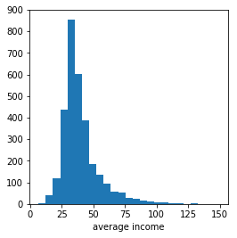
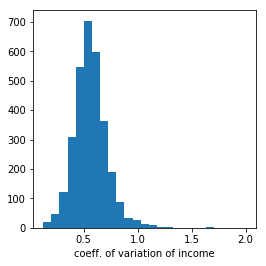
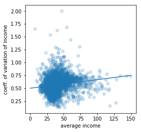
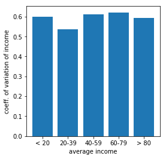
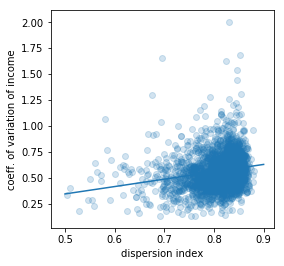
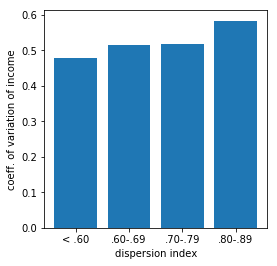
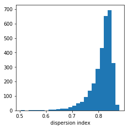
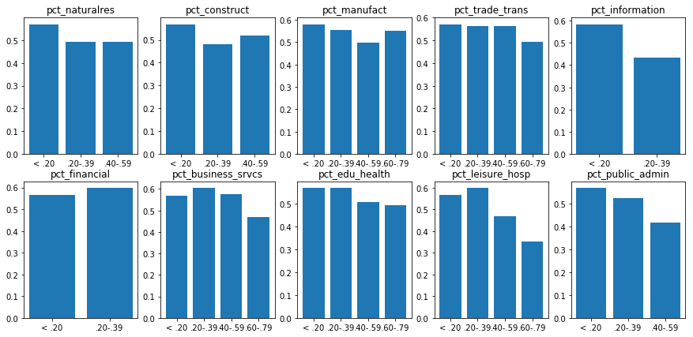

# QCEW Income Inequality

This project uses data from the [Quarterly Census of Employment and Wages](https://www.bls.gov/cew/downloadable-data-files.htm)
to compute estimates of the degree of income inequality for each county in the United States in the year 2019.
It also attempts to identify the characteristics associated with different degrees of income inequality.

As discussed below, the data suggests that counties with higher average income tend to have
higher degrees of income inequality.  The data also suggests that counties with a greater
dispersion of employment across supersectors tend to have higher degrees of income inequality.

That is what the data suggests.  Our task here is to identify correlations, not to speculate about causations.
But if we do, we must remember that many are possible.
In one county, expansion of economic opportunity may increase income inequality,
while in another county the high degree of income inequality may reflect limited economic opportunity.

## The Data

Here, we measure income inequality with the
[coefficient of variation](https://en.wikipedia.org/wiki/Coefficient_of_variation).
We calculate it from the "average annual pay" and "annual average employment level"
at the NAICS 6-digit aggregation level (the lowest level).
Also included in the dataset presented here are the statistics used to calculate
the coefficient of variation (mean, standard deviation and total employment).

Finally, the dataset also includes other variables which may explain differences in income inequality.
Those are the employment shares that we calculated at the supersector level (the highest level).

## The Analysis

Having measured income inequality, we wish to know what characteristics are associated
with differing degrees of inequality.

### Average Income

Perhaps the most important is average income.  Higher degrees of inequality are associated
with higher levels of average income.  The Pearson correlation coefficient between the
two variables is `0.14`, but that trend is not immediately evident when counties are grouped by average income.

Grouping counties by average income hides the positive correlation because the very-low average income group
exhibits income inequality that's just as high as the very-high average income group.
But because there are few counties in the very-low average income group, 
the overall correlation between average income and income inequality is positive.

The data used to generate the charts above can also be used to perform an ANOVA test of the null hypothesis
that the coefficient of variation of income does not depend on average income.
The F-statistic of `43.4` is high enough to reject that null hypothesis at all significance levels
(the p-value is near zero).

### Employment Dispersion

Counties with higher degrees of income inequality counties tend to have higher degrees of employment dispersion.
The Pearson correlation coefficient between the two variables is `0.25`.

Here, we index dispersion on a scale from `0` to `1`, where `0` means "no dispersion"
(everyone employed in the county was employed in the same supersector)
and `1` means "full dispersion" (everyone employed was employed in a different supersector).

The positive correlation between dispersion and income inequality makes intuitive sense
because counties where employment is more dispersed (among supersectors) exhibit a wider range
of labor activity, which is compensated a different rates.

Using an ANOVA test, we can reject the null hypothesis that the coefficient of variation of income
does not depend on employment dispersion.  The F-statistic of `38.1` is high enough to reject
the null hypothesis at all significance levels (the p-value is near zero).

We can also see the positive correlation between dispersion and income inequality in the
employment shares from which the dispersion index was derived.
When a large share of a county's workforce is employed within a single supersector,
the dispersion index will be low, and the resulting narrower range of labor activity
will narrow the degree of income inequality.

The barcharts above show that when employment is concentrated within a given supersector
(as reflected in a high employment percentage), the coefficient of variation of income
tends to be lower.

## Regression Models

Finally, we may use regression analysis to estimate how much a change in average income
or a change employment dispersion would affect the degree of income inequality.

### WLS Regression Models

. | **ln(cv pay)** |  | **ln(cv pay)** |  | **ln(cv pay)** |  | **ln(cv pay)** | .
--------------- | ------- | --- | ------- | --- | ------- | --- | ------- | ---
**ln(avg pay)** | 0.1383  | *** | 0.2083  | *** | 0.1275  | *** | 0.2463  | *** 
(s.e.)          | (0.008) |     | (0.013) |     | (0.009) |     | (0.015) | 
**dispersion**  | 0.9354  | *** | 1.0987  | *** | 0.9611  | *** | 0.9088  | *** 
(s.e.)          | (0.075) |     | (0.090) |     | (0.073) |     | (0.093) | 
**effects**     | none    |  | 10 supersec. |   | 52 state |    | 62 both | 
**R^2**         | 0.139   |     | 0.271   |     | 0.255   |     | 0.364   | 

* In all models, each observation is weighted by the employment level.
* To save space, we have not reported the intercept coefficient or (where applicable) the coefficients on the state effects and the coefficients on the supersector employment shares.

### Interpretation of the Regression Results

Because (for small changes) a log difference is approximately equal to a percentage change,
regressing the log of the coefficient of variation on the log of average income yields
a regression coefficient that can be interpreted as the elasticity of income inequality
with respect to average income.

This effect is not large.  In each model, the regression coefficients are statistically significant from zero, but small.
The *t-statistics* are all large enough to reject the null hypothesis that the true coefficient value is zero.
But the economic significance of an increase in average income is small.

The largest estimate (in the fourth model of the table above) suggests that a 10 percent increase in
average income would only increase the degree of income inequality by 2.5 percent.

Similarly, we can also map an increase the dispersion index to a predicted percentage increase in income inequality.
Once again, the *t-statistics* are all large enough to suggest that the coefficient on dispersion is statistically
significant from zero, but the economic effect is small.

For example, the fourth model predicts that a 0.01 point increase in the dispersion index
would increase the coefficient of variation of income 0.9 percent.

##  Conclusions

* Counties with higher degrees of income inequality tend to have:
   * higher average income
   * greater employment dispersion
* But their effects on income inequality are small.

##  Future Directions

Calculating the coefficient of variation of "average annual pay" from industry averages (as we have done here)
is an imperfect measure of income inequality.  It's not based on a household survey.  It's based on industry averages.

Nonetheless, it's a simple measure to calculate and the Bureau of Labor Statistics reports the
underlying statistics regularly.  So if in future work we found that our measure is highly correlated
with better measures of income inequality (i.e. those based on household surveys), then we could 
use it to study income inequality at the county level.

In particular, we might identify the regions of the United States where income inequality is highest and lowest.
And we might also conduct a panel study that looks at income inequality across counties over time.
